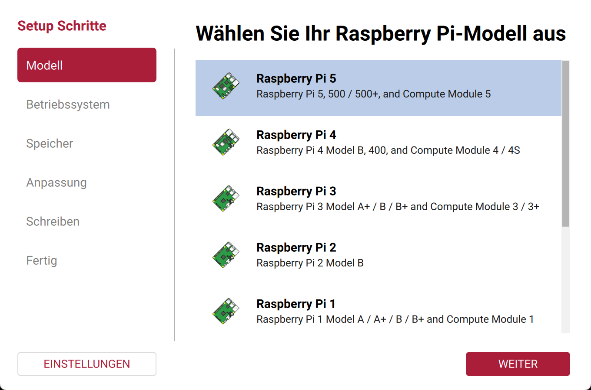
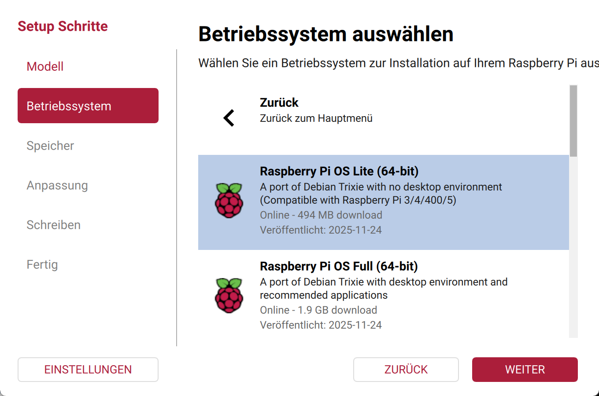
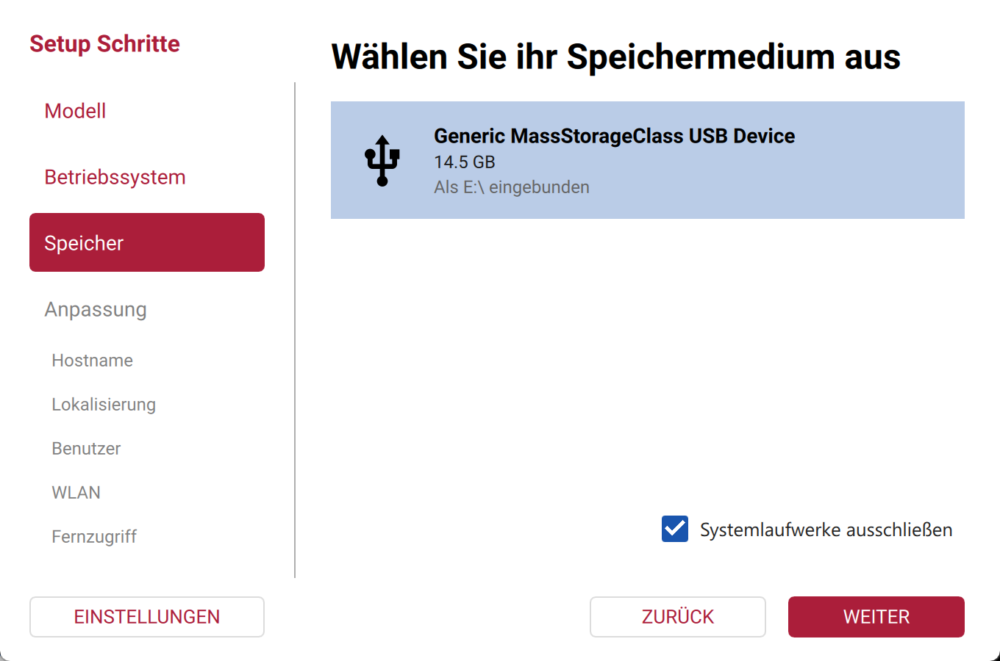
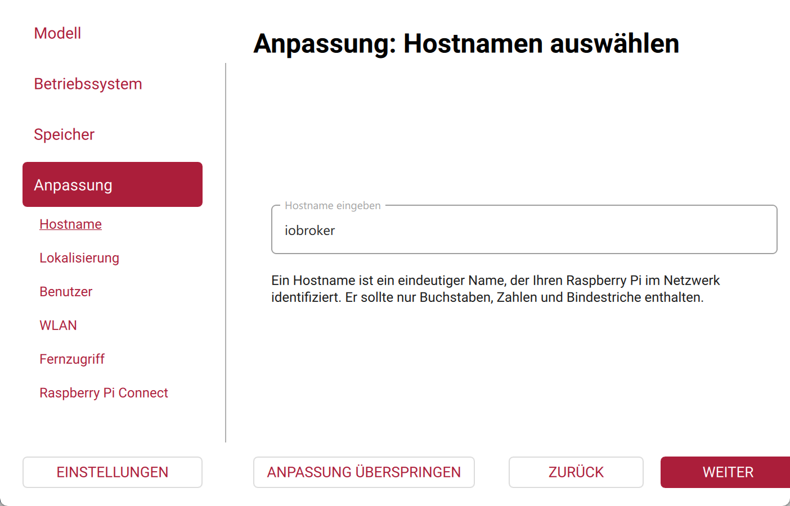
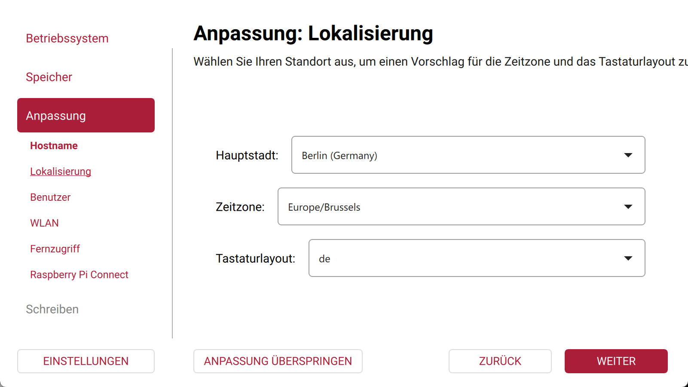
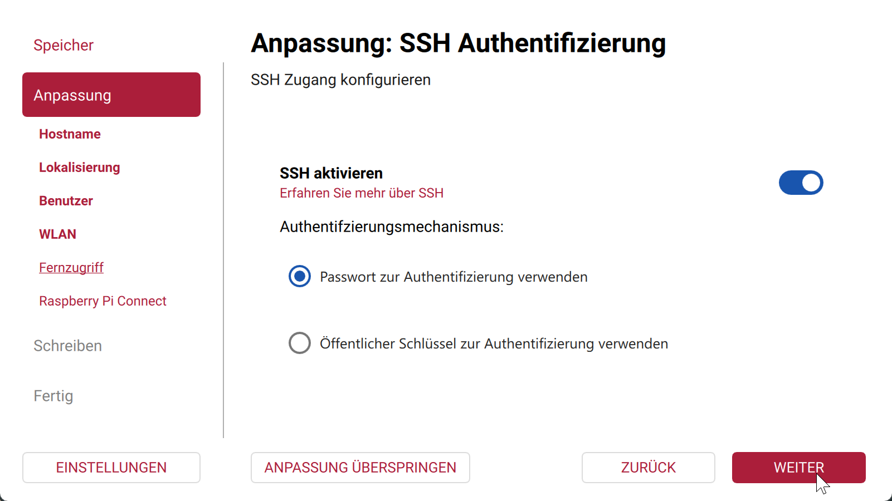
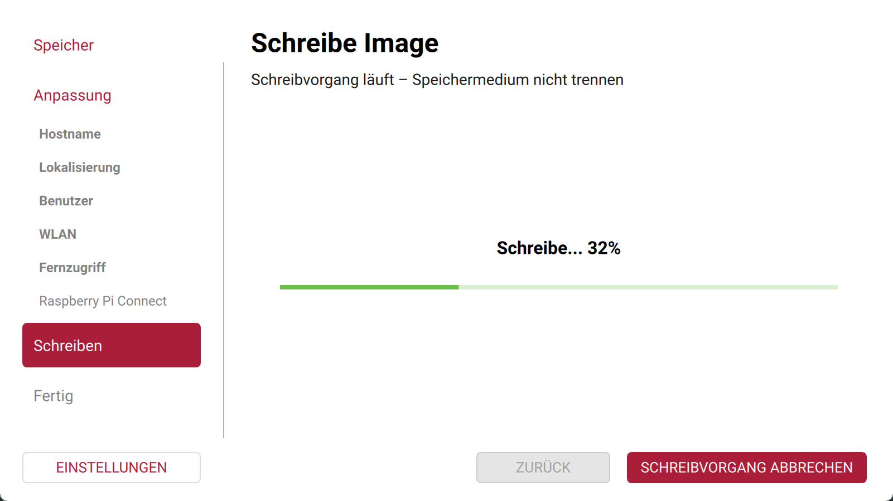
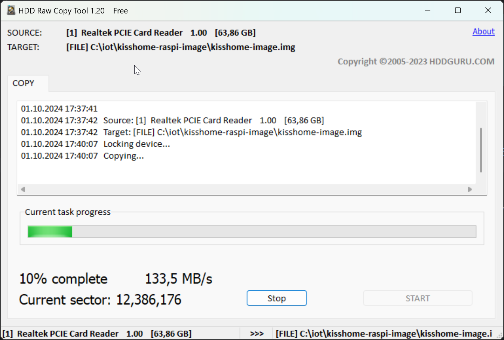

# raspi-image

This repository contains scripts to create and configure a Raspberry Pi image with preinstalled ioBroker adapters (e.g. `admin`, `welcome`, `wireless-settings`) and an alternative Kisshome image.

## Requirements

- Raspberry Pi 5  
- SD card (recommended: at least 16 GB)  
- [Raspberry Pi Imager](https://www.raspberrypi.com/software/) on your PC  
- Internet connection during installation  

## Create a base image with Raspberry Pi Imager

1. Start [Raspberry Pi Imager](https://www.raspberrypi.com/software/).
2. Select your raspberry pi version.
3. Select a suitable OS, e.g. `Raspberry Pi OS Lite (64-bit)` in "Other".
4. Select your SD card.
5. In the Imager settings, already configure:
    - Hostname
    - User and password
    - Wi-Fi (if needed)
    - SSH (recommended: enable)
   














---

## Create ioBroker image

When creating the image with Raspberry Pi Imager, use:

- Hostname: `iobroker`  
- Username: `iob`  
- Password: `2024=smart!` *(initial password, must be changed later\!)*

After the first boot, log in via SSH and run:

```bash
sudo sed -i 's/^#NTP=.*/NTP=time.google.com/' /etc/systemd/timesyncd.conf
sudo systemctl restart systemd-timesyncd

echo "sudo apt update"
sudo apt update
sudo apt install -y git

cd /opt
sudo git clone https://github.com/GermanBluefox/kisshome-raspi-image
sudo chmod +x /opt/kisshome-raspi-image/install.sh
sudo /opt/kisshome-raspi-image/install.sh
```

## Copy image
Use [HDDRawCopy1.20Portable.exe](https://hddguru.com/software/HDD-Raw-Copy-Tool/HDDRawCopy1.20Portable.exe) or [win32diskimager-1.0.0-install.exe](https://sourceforge.net/projects/win32diskimager/files/latest/download) to make an image.



## After creation
The ssh login is `iob` and the password is `2024=smart!`. Change the password immediately after the first reboot!

The root password is `2024=smartroot!`.
